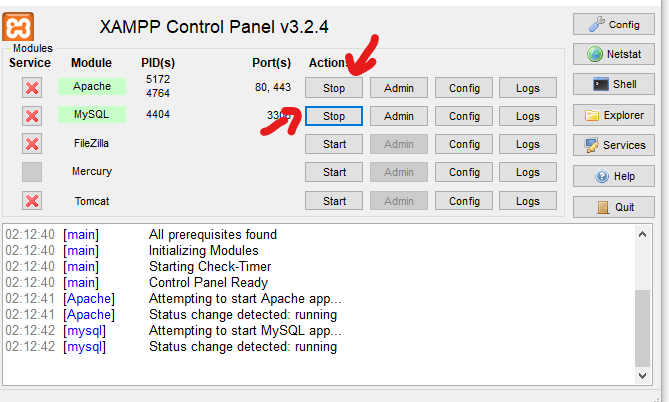
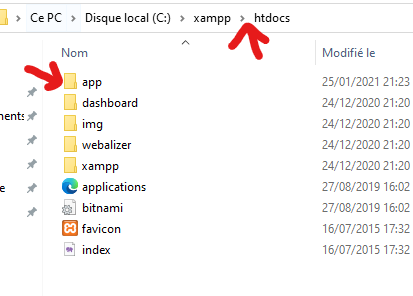
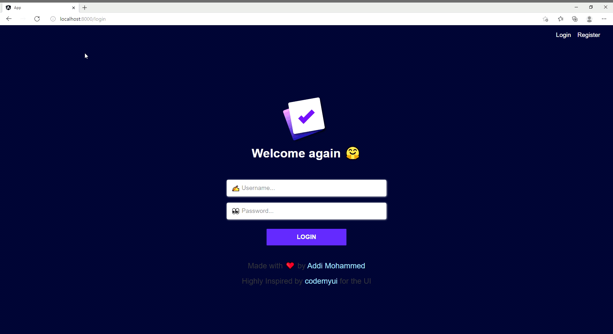

<h1 align="center">Application Web Todo 👋</h1>
<p>
  <a href="https://www.npmjs.com/package/todo" target="_blank">
    
  </a>
</p>

### 🏠 [Description](/)
```
Une application web qui permet aux utilisateurs de créer & d'enregister des tâches (à faire).
```


**Technolgie utiliser**
```
- Angular
- PHP
```


## Télécharger & Installer

* [Installer XAMPP](https://www.apachefriends.org/download.html)

## Execution

* Activer les services Apach & mySQL dans le logicel XAMPP.



* Copier le dossier "app" dans C : xampp/htdocs



* Entrer l'url suivant dans votre navigateur : http://localhost/app

## Preview


## Usage

* Crée un compte en vous rendant dans la page register à l'aide du lien en haut de la page.

* Vous serez retourné vers la page de connexion entrez vos informations de compte puis vous serez redirigé vers la page  où vous pouvez créé vos todos !

- Créé en premier une `catégorie` en remplissant le champ catégorie à gauche de la page

- Ensuite ajouter votre todo qui appartient à cette catégorie à la droite de la page.

## Options
### Edit
- Vous pouvez éditer vos todos simplement en cliquant sur le champ todo précedament créé et modifié le texte où il contient le todo sera automatiquement sauvegardé après avoir fini de taper le texte.
### Delete
- Vous pouvez supprimer vos todos en cliquant sur la croix tous à droite de la case.

- Vous pouvez supprimer vos catégories en cliquant sur la catégorie souhaiter la page se rafraichir ensuite appuyer sur le texte en bas du champ à remplir (delete catégorie).

## Remarque
Pour la base de données ce n'est pas la peine de la copier une base de données sera automatiquement créée si elle n'existe pad déjà.

## Autheur

👤 **Addi Mohammed**

* Github: [@AddiMohammedSaid](https://github.com/AddiMohammedSaid)

* LinkedIn: [@Addi Mohammed Said](https://www.linkedin.com/in/mohammed-said-addi-7a4069167/)

<br>
<br>

Merci ⭐️ d'avoir utilisé cette application web !

